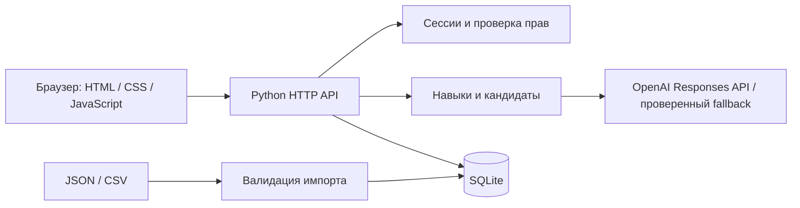

# hack-176032e6-ggbyte
Hackathon team repository for GGBYTE

# Career Quest

AI-навигатор развития сотрудника для кейса Halyk Bank на HackAlem AI.
Сотрудник видит цель, разрывы в навыках и до трёх доступных шагов с объяснением.
После завершения активности навыки и прогресс пересчитываются. HR видит дефициты
компетенций, участие и сотрудников без доступного следующего шага.

## Статус

Рабочий прототип: кабинет сотрудника, изменение цели, история, HR-обзор, импорт
JSON/CSV, сохранение в SQLite и проверки доступа. Основной AI-провайдер — OpenAI
Responses API со структурированным ответом. Также поддерживаются NVIDIA и Ollama.
Без ключа или при сбое модели интерфейс честно показывает многофакторный подбор.
Внешняя передача признаков требует явной настройки `CQ_ALLOW_CLOUD_DATA=true`.

## Запуск одной командой

Требуется Python **3.11+**. Библиотеки через pip устанавливать не нужно.

```bash
python run.py
```

Открыть **http://127.0.0.1:8000**. На Windows вместо `python` можно использовать `py`.
На чистом клоне создаётся небольшой независимый демонстрационный набор из
`examples/demo.py`. Это самостоятельно составленные примеры, а не данные организаторов.

| Режим | Логин | Демонстрационный пароль |
| --- | --- | --- |
| Сотрудник | `E0001` | `quest-demo` |
| HR | выбрать режим HR | `hr-quest-demo` |

Эти учётные записи предназначены только для локальной демонстрации. Остальные
сотрудники получают разные случайные пароли, сохраняемые локально в
`runtime/employee-credentials.json`. HR может открывать любой профиль без
переключения учётной записи. Демонстрационный пароль не позволяет войти за другого сотрудника.

Другой порт: `python run.py --port 8001`. Остановка: `Ctrl+C` в терминале сервера.

## Датасет HackAlem

Официальный датасет не включён в Git: ТЗ ограничивает его распространение.
Архив должен быть получен участником или жюри от организаторов.

**На чистом клоне до первого запуска**:

```bash
python run.py --dataset "C:\path\career_quest_dataset.zip"
```

Команда безопасно извлекает только `employees.json`, `events.json`, `skills.json`,
`activity_history.csv` и запускает приложение. Пути из ZIP не используются для записи.
Можно также положить эти четыре файла в `data/` и выполнить `python run.py`.

Если ранее запускались демонстрационные данные, остановите приложение и перенесите
`runtime/career.sqlite3` в резервную папку **вне runtime** перед загрузкой стартового
архива. Импортёр намеренно не заменяет существующую базу молча. Сохранённая база
имеет приоритет над файлами исходного набора.

Дата расчётов берётся из `employees.meta.as_of_date`, а не из системных часов:
для исходного набора это `2026-10-01`.

## AI-слой

### OpenAI API

Скопировать `.env.example` в `.env`, добавить ключ на сервере и разрешить отправку
обезличенных признаков, если это допустимо для используемых данных:

```dotenv
AI_PROVIDER=openai
OPENAI_API_KEY=your-key
OPENAI_MODEL=gpt-4.1-mini
CQ_ALLOW_CLOUD_DATA=true
```

Перезапустить приложение после изменения `.env`. Используется `store=false` и
JSON Schema с допустимыми ID кандидатов. Ключ не передаётся браузеру.
Для NVIDIA заменить `AI_PROVIDER=nvidia` и заполнить `NVIDIA_API_KEY`.
Модель указывается через `OPENAI_MODEL` или `NVIDIA_MODEL`.

Проверить ключ и реальный выбор модели **только на независимом примере из репозитория**:

```bash
python scripts/check_ai.py
```

Этот скрипт не читает `data/` и SQLite. Проверяется сценарий, где критичен System Design,
а самый низкий Public Speaking связан с повторными пропусками. В проверке на ноутбуке
команды OpenAI `gpt-4.1-mini` выбрал критический навык за 4,15 секунды. Это отдельный
тестовый запрос, а не гарантия задержки для всех профилей.

### Что именно делает модель

1. Сервер отсеивает обязательные, уже завершённые, недоступные по роли/грейду,
   предпосылкам и расписанию мероприятия.
2. Рассчитывает фактический прирост навыков и многофакторный приоритет кандидатов.
3. LLM получает до восьми проверенных кандидатов и выбирает 1–3 шага с учётом
   критичности разрывов, грейда, истории участия, формата и трудозатрат.
4. Ответ проверяется: неизвестные ID, дубликаты и неверная структура отклоняются.
5. Обоснование собирается из проверенных фактов профиля, требований и истории;
   модель не может придумывать новые курсы или обещать повышение.

LLM выполняет выбор внутри доступного набора. Проверка доступности и арифметика
навыков выполняются кодом. При отсутствии модели или тайм-ауте используется
объяснимый подбор правил, который **не выдаётся за ответ LLM**.

Ожидание ответа модели ограничено 8 секундами; одинаковые результаты кэшируются
на 10 минут. Фактическая задержка успешного ответа отображается в интерфейсе.
Перед защитой нужно проверить доступность выбранной модели и фактическую задержку.

### Граница данных

Отправка признаков провайдеру требует явного `CQ_ALLOW_CLOUD_DATA=true`.
Наличие ключа само по себе передачу не включает.
Ключи читаются сервером и не попадают в браузер или Git. Имена, ID сотрудников и
исходная история никогда не включаются в запрос модели; передаются только признаки
кандидатов с временными ID. Это минимизация данных, а не автоматическое разрешение
на их передачу. Оригинальные JSON/CSV и локальная база не публикуются в Git.
ТЗ разрешает облачные LLM и одновременно ограничивает вынос датасета. Если у команды
нет разъяснения организаторов о передаче производных признаков, следует оставить
`CQ_ALLOW_CLOUD_DATA=false`; интерфейс явно покажет, что работает подбор без вызова LLM.

Для полностью локального режима можно использовать `AI_PROVIDER=ollama` и
установленную модель `OLLAMA_MODEL` на `http://127.0.0.1:11434`; для основного
сценария с OpenAI устанавливать Ollama не требуется.

## Логика рекомендации и прогресса

- Цель: `career_goal`; если цель не задана — следующий грейд текущей роли.
  Для Lead без следующего грейда используются требования Lead.
- Недостающий навык считается равным 0.
- Завершения **после** `last_review_date` и не позже даты среза применяются по порядку.
  Завершения до оценки уже отражены в профиле и повторно не добавляются.
- Новый уровень: `max(old, min(5, max_level, old + gain))`.
- Прогресс: `sum(min(current, required)) / sum(required) × 100%`.
  Готовность критических навыков показывается отдельно.
- Критические разрывы получают вес 4, остальные — 1. Дополнительно учитываются
  последние 12 похожих участий, пропуски/отказы, уже начатое обучение, формат и длительность.
  Полная формула находится в `career/engine.py` и доступна для аудита.
- Подготовительный курс может быть предложен, если открывает предпосылки для
  другой полезной активности (поиск на один шаг вперёд).
- Регулярный клуб `EV_036` можно повторять в разные дни. Остальные завершённые
  мероприятия повторно не рекомендуются.
- Если полезного доступного шага нет, система сообщает об этом и предлагает
  индивидуальный план с HR вместо выдуманной рекомендации.

## Загрузка проверочных профилей жюри

Войти как HR → **Загрузка данных** → выбрать JSON профилей и/или CSV истории →
**Проверить и загрузить**. Затем открыть **Обзор HR**, найти сотрудника и нажать на имя.

Поддерживается JSON `{ "employees": [...] }`, массив профилей или один профиль.
CSV использует исходные столбцы датасета. Новые ID добавляются; совпадающие
`employee_id` и `record_id` обновляются. Дубликаты внутри файла отклоняются.
Валидация всего объединённого набора предшествует сохранению; неуспешный импорт
не изменяет профили и историю. Каталог событий и требования по грейдам остаются исходными.

## Архитектура



| Компонент | Файл |
| --- | --- |
| API, сессии, проверка ролей | `server.py` |
| Навыки, фильтрация, ранжирование | `career/engine.py` |
| LLM, тайм-аут, кэш и проверка ответа | `career/ai.py` |
| SQLite и импорт | `career/store.py` |
| Интерфейс | `static/` |
| Независимый демонстрационный набор | `examples/demo.py` |
| Тесты алгоритма и HTTP API | `tests/` |

## Проверка

```bash
python -m unittest discover -v
```

Тесты не требуют API, модели или данных организаторов. Проверяются критический
навык против «самого низкого», пропуски, доступность и повторные завершения,
границы роста, учёт последней оценки, атомарность и сохранение импорта,
запрет чужих профилей/HR-операций, отключение облака и проверка ответа LLM.

## Соответствие обязательным требованиям

| Требование | Реализация |
| --- | --- |
| Профиль и траектория | Кабинет и экран «Навыки и цель» |
| 1–3 рекомендованных шага | Проверенные кандидаты + выбор LLM при подключённой модели |
| Объяснение минимум по трём факторам | Роль/грейд, разрывы и требования цели, история участия |
| Обновление прогресса | «Отметить выполненным», пересчёт и сохранение SQLite |
| HR-view | Разрывы навыков, отсутствие шагов, неактивность, участие |
| Дополнительные профили | Импорт JSON/CSV в HR-кабинете |
| Разделение прав | Серверная проверка роли и владельца профиля |
| Воспроизводимость | Запуск одной командой, независимые примеры, тесты |

## Ограничения прототипа

- Локальная демонстрация, не банковская production-система: нет SSO, MFA, TLS,
  аудита действий HR и инфраструктуры высокой доступности. Сервер слушает только localhost.
- Завершение активности отмечается пользователем для демонстрации сценария;
  в реальной системе оно должно подтверждаться LMS/HR-системой.
- Нет публичного рейтинга сотрудников и наград за обязательные процессы.
- HR-«неактивность» означает отсутствие добровольных завершений за 90 дней,
  а не оценку эффективности или прогноз увольнения.
- Интерфейс на русском; названия исходных навыков и мероприятий сохраняются как в датасете.
- Качество LLM и соблюдение задержки нужно отдельно проверять на выбранной модели.

Сценарий демонстрации: [docs/DEMO.md](docs/DEMO.md).
