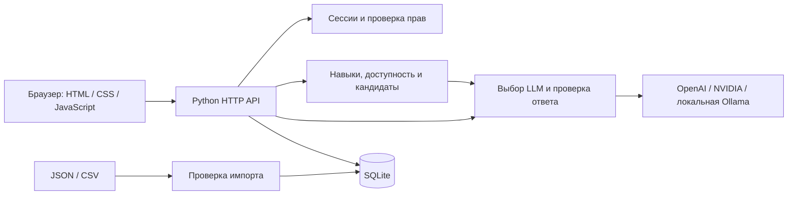

# Career Quest

AI-навигатор развития сотрудника. Проект команды **GGBYTE** для кейса Halyk Bank на **HackAlem AI**.

Репозиторий команды: [BAITC-Hacks/hack-176032e6-ggbyte](https://github.com/BAITC-Hacks/hack-176032e6-ggbyte).

## 1. Краткое описание

Сотрудник получает разрозненные приглашения на обучение и не видит, как они связаны с карьерной целью. Career Quest связывает профиль, историю участия и требования целевого грейда: показывает разрывы в навыках, предлагает следующие шаги и объясняет пользу каждого. HR получает обзор дефицитов компетенций и сотрудников, которым нужен дополнительный план развития.

Текущая версия — веб-приложение для локальной демонстрации и проверки жюри. Для работы AI необходим настроенный внешний API или установленная локальная модель. Без модели приложение работает с явно обозначенным многофакторным подбором по правилам.

## 2. Что реализовано

| Возможность | Что можно проверить |
| --- | --- |
| Кабинет сотрудника | Роль, грейд, цель, навыки, история и текущий прогресс |
| Карьерная цель | Выбор целевой роли и грейда, пересчёт разрывов |
| Рекомендации | До трёх доступных добровольных активностей; при подключённой модели выбор выполняет LLM |
| Объяснения | Соответствие роли/грейду, требования цели и разрывы, история похожих участий |
| Прогресс | Завершение активности, изменение навыков по `gain`/`max_level`, сохранение в SQLite |
| HR-обзор | Частые дефициты навыков, сотрудники без следующего шага, участие по активностям |
| Дополнительные данные | Загрузка профилей JSON и истории CSV через кабинет HR |
| Разделение доступа | Сотрудник видит свой профиль; HR может открывать все профили и импортировать данные |
| Устойчивость к сбою AI | Проверка ответа, ограничение ожидания, кэш и явно обозначенный fallback |
| Локальная проверка | Независимые демонстрационные данные, автоматические тесты и диагностика |

Если доступного полезного шага нет, приложение сообщает об этом и предлагает обсудить план с HR. Пустая рекомендация не заменяется выдуманным мероприятием.

## 3. Как работает решение

1. Приложение читает профили, каталог мероприятий, требования по навыкам и историю из JSON/CSV. Сохранённые изменения загружаются из SQLite.
2. Сотрудник входит в кабинет и видит текущую или выбранную карьерную цель.
3. Сервер рассчитывает актуальные навыки и отсеивает обязательные, уже завершённые и недоступные по роли, грейду, предпосылкам или расписанию мероприятия.
4. Кандидаты оцениваются с учётом критических разрывов, истории участия, формата, длительности и уже начатого обучения. Подключённая LLM получает до восьми кандидатов и выбирает 1–3 шага.
5. Сервер проверяет ответ модели. Объяснения и прогноз прогресса строятся из фактов профиля и каталога; неизвестные ID и дубликаты отклоняются.
6. После отметки о завершении навыки, история и рекомендации пересчитываются; результат сохраняется. HR видит обновлённый срез и может загрузить проверочные профили.

### Расчёт навыков и прогресса

- Цель берётся из `career_goal`; иначе используется следующий грейд текущей роли. Для Lead без заданной цели используются требования Lead.
- Отсутствующий навык считается равным 0. Учитываются завершения после `last_review_date` и не позже даты среза; более ранние завершения уже отражены в оценке.
- Рост навыка: `max(old, min(5, max_level, old + gain))`.
- Прогресс: `round(100 × sum(min(current, required)) / sum(required))`. Готовность критических навыков показывается отдельно.
- До полного выполнения всех требований округлённый прогресс ограничен 99%; 100% означает, что разрывов действительно нет.
- В оценке кандидатов критический разрыв имеет вес 4, остальные — 1; дополнительно учитываются последние 12 похожих участий, пропуски, формат и длительность.
- Подготовительный шаг может быть предложен, если открывает доступ к полезному мероприятию: проверяется один последующий шаг.
- Повторное завершение запрещено; исключение — регулярный клуб `EV_036`, который можно повторять в разные дни.

Реализация формул: [career/engine.py](career/engine.py). Прогресс означает покрытие требований цели, а не гарантированное повышение.

## 4. Технологии

| Слой | Технологии |
| --- | --- |
| Backend | Python 3.11+, стандартная библиотека: `http.server`, `sqlite3`, `urllib`, `concurrent.futures` |
| Frontend | HTML, CSS, JavaScript, Fetch API; без frontend-фреймворка и сборки |
| Хранение | Локальная SQLite, исходные JSON/CSV |
| Основной AI-провайдер | OpenAI Responses API; модель по умолчанию `gpt-4.1-mini`, Structured Outputs / JSON Schema, `store=false` |
| Альтернативный облачный AI | NVIDIA API; модель по умолчанию `meta/llama-3.1-8b-instruct` |
| Локальный AI | Ollama HTTP API; модель по умолчанию `qwen2.5:1.5b` |
| Тестирование | Python `unittest`, HTTP-проверки на временном локальном сервере |
| Проверки в GitHub | Workflow `.github/workflows/tests.yml`: тесты и компиляция Python 3.11 / 3.13 |

Зависимости через `pip` или `npm` устанавливать не требуется. Код поддерживает три AI-провайдера; качество и скорость выбранной модели проверяются отдельно командой `scripts/check_ai.py`. Наличие workflow не означает, что удалённые проверки успешно выполнены: их статус нужно смотреть в GitHub Actions.

## 5. Архитектура проекта



| Компонент | Файл или каталог |
| --- | --- |
| Запуск и выбор стартового набора | [run.py](run.py) |
| HTTP API, сессии, права, HR-агрегаты | [server.py](server.py) |
| Навыки, доступность, оценка кандидатов | [career/engine.py](career/engine.py) |
| Провайдеры, проверка ответа, тайм-аут, кэш | [career/ai.py](career/ai.py) |
| SQLite, валидация и объединение импорта | [career/store.py](career/store.py) |
| Интерфейс | [static/](static/) |
| Независимые примеры | [examples/demo.py](examples/demo.py) |
| Импорт архива, диагностика, проверка AI | [scripts/](scripts/) |
| Тесты | [tests/](tests/) |

Ключ API используется только сервером. Ожидание модели ограничено 8 секундами, успешные ответы кэшируются на 10 минут. LLM выбирает шаги из подготовленного списка и не изменяет данные самостоятельно. При недоступной модели или невалидном ответе интерфейс показывает подбор по правилам.

## 6. Установка и запуск

### 6.1. Получить проект

Нужны **Git**, **Python 3.11+** и браузер. Для клонирования требуется доступ к репозиторию команды.

```bash
git clone https://github.com/BAITC-Hacks/hack-176032e6-ggbyte.git
cd hack-176032e6-ggbyte
python --version
```

Если проект уже открыт в локальной папке команды, выполнять повторное клонирование не нужно. Все последующие команды выполняются из корня проекта. На Windows вместо `python` можно использовать `py`.

### 6.2. Выбрать AI-провайдера

Создать `.env` из шаблона, сохранив существующий файл, если он уже есть.

**Windows PowerShell:**

```powershell
if (!(Test-Path .env)) { Copy-Item .env.example .env }
notepad .env
```

**macOS / Linux:**

```bash
test -f .env || cp .env.example .env
```

Затем открыть `.env` в редакторе. Заполнить один из вариантов ниже. Настройки окружения процесса имеют приоритет над `.env`; после изменения настроек нужно перезапустить приложение.

**OpenAI:**

```dotenv
AI_PROVIDER=openai
OPENAI_API_KEY=your-api-key
OPENAI_MODEL=gpt-4.1-mini
CQ_ALLOW_CLOUD_DATA=true
```

`CQ_ALLOW_CLOUD_DATA=true` включает передачу признаков внешнему сервису. Использовать только для данных, для которых такая обработка разрешена; подробности в разделе 8. Само наличие ключа облачные запросы приложения не включает. Ключ нельзя добавлять в Git или frontend-код.

**NVIDIA:**

```dotenv
AI_PROVIDER=nvidia
NVIDIA_API_KEY=your-api-key
NVIDIA_MODEL=meta/llama-3.1-8b-instruct
CQ_ALLOW_CLOUD_DATA=true
```

**Локальная Ollama:** установить [Ollama](https://docs.ollama.com/quickstart), запустить приложение или службу, загрузить модель:

```bash
ollama pull qwen2.5:1.5b
ollama run qwen2.5:1.5b
```

Выйти из чата командой `/bye`. Если служба не запущена автоматически, выполнить `ollama serve` в отдельном терминале. В `.env` указать:

```dotenv
AI_PROVIDER=ollama
OLLAMA_MODEL=qwen2.5:1.5b
CQ_ALLOW_CLOUD_DATA=false
```

Можно указать другую установленную модель. Приложение обращается к Ollama по адресу `http://127.0.0.1:11434`; скорость зависит от оборудования и модели. Для OpenAI или NVIDIA установка Ollama не нужна.

**Проверка провайдера:**

```bash
python scripts/check_ai.py
```

Скрипт делает настоящий запрос выбранной модели на независимом примере из репозитория. Он не читает `data/` или SQLite и работает даже при `CQ_ALLOW_CLOUD_DATA=false`: этот флаг защищает данные приложения, а проверочный скрипт использует только собственный пример. Ожидается `PASS`, первым выбран критический System Design. При ошибке выводятся тип ошибки и HTTP-статус без ключа. Для проверки требования по задержке ответ должен укладываться в 10 секунд.

### 6.3. Выбрать данные и запустить

**Встроенные примеры, без архива организаторов:**

```bash
python run.py
```

На чистом клоне автоматически создаются независимые данные из `examples/demo.py`.

**Официальный датасет — альтернативный первый запуск:**

```bash
python run.py --dataset "C:\path\career_quest_dataset.zip"
```

Заменить путь на расположение полученного от организаторов архива. Импортируются только четыре ожидаемых файла: `employees.json`, `events.json`, `skills.json`, `activity_history.csv`. Также можно заранее поместить их в `data/` и выполнить `python run.py`.

Если приложение уже запускалось на другом наборе, сначала остановить его и перенести `runtime/career.sqlite3` в резервную папку вне `runtime`. Затем импортировать архив. Существующая SQLite имеет приоритет над исходными профилями и историей; импортёр не заменяет её молча. Для восстановления старого набора нужно сохранить также его исходные файлы `data/`.

### 6.4. Открыть приложение

Локальный адрес: **http://127.0.0.1:8000**.

| Режим | Логин | Пароль по умолчанию |
| --- | --- | --- |
| Сотрудник | `E0001` | `quest-demo` |
| HR | Выбрать режим HR | `hr-quest-demo` |

Пароли предназначены для локальной демонстрации. Их можно заменить через `CQ_EMPLOYEE_PASSWORD` и `CQ_HR_PASSWORD` в `.env`. Остальные сотрудники получают отдельные случайные пароли в локальном `runtime/employee-credentials.json`; общий демонстрационный пароль к ним не подходит. HR может открывать профили из своего кабинета.

Другой порт: `python run.py --port 8001`. Остановка: `Ctrl+C` в терминале сервера. SQLite сохраняет прогресс между запусками; после перезапуска сервера нужно войти снова.

## 7. Как проверить решение

### Автоматические проверки

```bash
python -m unittest discover -v
python scripts/doctor.py
```

Тесты используют независимые примеры и не требуют API-ключа. Проверяются многокритериальный выбор, доступность мероприятий, рост навыков, завершение и запрет повтора, импорт и сохранение, права доступа, отключение облака, невалидный ответ LLM и кэш.

`doctor.py` проверяет настройки, структуру данных и расчёт для каждого профиля, не делает сетевых запросов и не изменяет SQLite. Коды завершения: `0` — локальные проверки пройдены, AI включён настройками; `2` — расчёты пройдены, AI приложения выключен; `1` — ошибка данных или выполнения. Код `0` не доказывает доступность модели — для этого нужен `scripts/check_ai.py`.

### Повторяемый сценарий для жюри: встроенный набор

Сценарий рассчитан на **первый запуск на чистом клоне со встроенными примерами**. На официальном наборе и после сохранённых действий значения будут другими.

1. Настроить выбранную модель, проверить её через `python scripts/check_ai.py`, запустить `python run.py`.
2. Войти как `E0001` с паролем `quest-demo`. Цель — Backend Engineer / Senior, начальный прогресс — **50%**, System Design — **2** при требовании **4**, Public Speaking — **0**.
3. Проверить рекомендацию «Практика проектирования систем». В объяснении видны роль/грейд, критический разрыв и история. У сотрудника три пропуска активностей Public Speaking: выбор не должен сводиться к самому низкому навыку. Для подтверждения LLM дождаться подписи «шаги выбраны моделью»; fallback означает, что этот запрос выполнен без LLM.
4. Отметить «Практику проектирования систем» выполненной. System Design становится **4**, прогресс — **70%**. В истории появляется завершение, повторное выполнение этого курса недоступно. Обновить страницу и проверить сохранение результата.
5. Выйти и войти как HR. Открыть дефициты навыков, участие по активностям и фильтр сотрудников без следующего шага. У `DEMO2` цель уже выполнена: **100%**, список рекомендаций пуст.
6. Проверить импорт: на встроенном наборе создать дополнительный профиль командой ниже, загрузить `runtime/jury-profile.json` через «Загрузка данных» в HR-кабинете, затем найти `JURY_DEMO` в HR-обзоре.

```bash
python -c "import json; from pathlib import Path; from examples.demo import dataset; p=dataset()['employees']['employees'][0]; p['employee_id']='JURY_DEMO'; p['full_name']='Jury Demo'; Path('runtime').mkdir(exist_ok=True); Path('runtime/jury-profile.json').write_text(json.dumps({'employees':[p]}, ensure_ascii=False), encoding='utf-8')"
```

Этот профиль использует ID навыков встроенного набора; он не подходит для каталога организаторов. На официальном наборе загружать JSON/CSV жюри с соответствующими ID. Дополнительный сценарий защиты: [docs/DEMO.md](docs/DEMO.md).

В форме импорта есть вариант **«Вставить JSON / CSV текстом»**: вставьте содержимое файлов в соответствующие поля и нажмите «Проверить и загрузить». Для одного типа данных используйте либо файл, либо текст. Ограничение — 4 МБ суммарно; серверная валидация одинакова для обоих способов.

### Полный HTTP-сценарий с реальной моделью

```bash
python scripts/check_ai_workflow.py
```

Скрипт создаёт временный набор из `examples/demo.py`, запускает отдельный локальный HTTP-сервер, входит сотрудником, вызывает `/api/ai`, проверяет реальный ответ модели и завершение активности с сохранением прогресса 50% → 70%. Исходный датасет и база приложения не читаются; `.env` не меняется. Для собственных временных примеров скрипт разрешает облачный запрос только внутри своего процесса, поэтому может работать при выключенном `CQ_ALLOW_CLOUD_DATA` основного приложения. Требуются ключ и доступ к выбранной модели.

## 8. Данные и интеграции

### Источники данных

| Источник | Использование |
| --- | --- |
| `employees.json` | Профили, роли, грейды, цели, оценённые навыки и дата среза |
| `events.json` | Каталог, доступность, развиваемые навыки, `gain` и `max_level` |
| `skills.json` | Справочник навыков, требования и критические навыки по ролям/грейдам |
| `activity_history.csv` | Завершения, начатые активности, пропуски и отказы |
| `examples/demo.py` | Независимый набор: 3 профиля, 5 событий, 3 навыка и 3 записи истории |
| `runtime/career.sqlite3` | Сохранённые профили, история и изменения пользователя |

Стартовый архив организаторов не включён в репозиторий. Его нужно получить отдельно в рамках хакатона. Дата расчётов берётся из `employees.meta.as_of_date`, а не из системных часов.

HR-импорт принимает JSON `{ "employees": [...] }`, массив профилей или один профиль, а также CSV истории в схеме стартового набора. Совпадающие `employee_id` и `record_id` обновляются, новые добавляются. Дубликаты внутри файла отклоняются. Данные проверяются до сохранения; каталог мероприятий и требования к грейдам этим импортом не меняются.

### Внешние сервисы и передаваемые сведения

- OpenAI: `https://api.openai.com/v1/responses`.
- NVIDIA: `https://integrate.api.nvidia.com/v1/chat/completions`.
- Локальная Ollama: `http://127.0.0.1:11434/api/generate`.

Модель получает текущий/целевой грейд, признак смены роли, параметры кандидатов, разрывы навыков и агрегаты участия. Имена, ID сотрудников, исходные ID событий и сырая история в запрос не включаются; кандидатам присваиваются временные ID. Параметр OpenAI `store=false` не означает, что запрос выполняется локально.

ТЗ разрешает облачные модели и одновременно ограничивает вынос выданных данных за пределы хакатона. Отдельного разъяснения о передаче производных признаков в репозитории нет. Для данных без подтверждённого разрешения на внешнюю обработку оставлять `CQ_ALLOW_CLOUD_DATA=false` и использовать локальную модель. Для независимых примеров можно отдельно настроить облачный режим.

`.env`, `data/`, `runtime/` и ZIP-архивы исключены из Git. Интеграций с банковской HR-системой, LMS, календарями или мессенджерами в текущем коде нет.

## 9. Известные ограничения

- Приложение слушает только localhost и использует стандартный HTTP-сервер Python. Нет production-инфраструктуры, TLS, SSO/MFA, аудита действий HR и высокой доступности.
- Демонстрационные пароли открыто указаны в интерфейсе; индивидуальные локальные пароли хранятся в файле. Это механизм локальной проверки, а не банковская система аутентификации.
- Выполнение активности отмечает пользователь. Интеграции с LMS для подтверждения прохождения нет.
- AI требует доступной настроенной модели. Многофакторный fallback не является успешным ответом LLM. Поддержка провайдера в коде не гарантирует качество конкретной модели или задержку до 10 секунд.
- LLM выбирает среди максимум восьми предварительно отобранных кандидатов; объяснения формируются кодом. Автономных действий от имени сотрудника и мультиагентной системы нет.
- Интерфейс на русском; названия из загруженного датасета сохраняются без автоматического перевода. Казахская локализация интерфейса не реализована.
- Нет валюты, магазина наград, признания коллег и прогноза оттока. Публичные рейтинги сотрудников и награды за обязательные процессы отсутствуют.
- «Нет завершений 90 дней» — показатель участия в добровольных активностях, а не оценка эффективности сотрудника.
- Совместимость с дополнительными профилями требует соблюдения схемы и ID текущего каталога. Результат на скрытых профилях жюри заранее не известен.

## 10. Развёрнутая версия

Публичная deployed-версия отсутствует. Приложение запускается локально по инструкции выше: **http://127.0.0.1:8000**. Этот адрес доступен только на компьютере, где работает сервер, и не является внешней ссылкой для жюри.

## 11. Дополнительные материалы

- [Сценарий защиты и работа с Git](docs/DEMO.md).
- [Сверка с требованиями и результаты локальных проверок](docs/REQUIREMENTS.md).
- [Отчёт о проверке работоспособности и её ограничениях](docs/QA.md).
- [Подробный аудит по ТЗ после объединения PR №2](docs/AUDIT.md).
- [Шаблон настройки провайдеров](.env.example).
- [Исходное ТЗ Career Quest](https://docs.google.com/document/d/18SlxWxz_Vj_eag_UfEQ6t6g59jCxGTgu5x4QoylDbqI/preview).

Для сдачи отправить актуальные коммиты в репозиторий команды и отдельно зарегистрировать решение на платформе HackAlem через страницу треков и кнопку «Сдать решение». Сам по себе `git push` заявку на платформе не отправляет.
