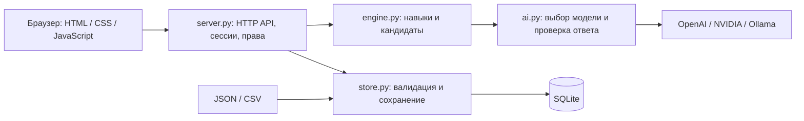

# GGBYTE SKILLS

**AI-навигатор развития сотрудников** — проект команды **GGBYTE** для кейса **Career Quest** от Halyk Bank на HackAlem AI.

[Репозиторий команды](https://github.com/BAITC-Hacks/hack-176032e6-ggbyte)

## Краткое описание

GGBYTE SKILLS помогает сотруднику связать обучение с карьерной целью: увидеть текущие навыки, сравнить их с требованиями выбранной роли и грейда, выбрать полезную активность и проследить изменение прогресса. HR получает список сотрудников, дефициты навыков и сведения об участии в обучении.

Текущая версия — локальное веб-приложение для демонстрации и проверки жюри. Оно работает без API-ключа с подбором по правилам. При подключении поддерживаемой модели AI выбирает активности из предварительно проверенного каталога; режим подбора явно указан в интерфейсе.

## Что реализовано

| Возможность | Результат для пользователя |
| --- | --- |
| Обзор сотрудника | Текущая роль, грейд, цель, прогресс, фокус развития и последние активности |
| Карьерные цели | Каталог ролей и грейдов: сравнение требований, разрывов и готовности до выбора цели |
| Карта навыков | Текущие и требуемые уровни, поиск, фильтры ключевых навыков, разрывов и достигнутых уровней; отсутствующий требуемый навык учитывается с уровнем 0 |
| Рекомендации | До трёх доступных добровольных активностей с прогнозом изменения навыков и прогресса |
| Сравнение шагов | Таблица для 2–3 рекомендаций: время, формат, эффект и отдельный прогноз каждого шага |
| Каталог обучения | Описания всех активностей, эффекты и условия участия, поиск и фильтры по навыку и доступности |
| Объяснения | Факторы соответствия роли и грейду, карьерной цели, разрывам навыков и истории участия |
| Завершение активности | Пересчёт навыков, запись в историю, сохранение результата в SQLite |
| История | Поиск, статусы, периоды 30/90/365 дней, сортировка и сброс фильтров |
| Кабинет HR | Три состояния маршрута: цель достигнута, есть шаг, нужен план с HR; метрики с переходом к отфильтрованному списку |
| Списки и аналитика HR | Поиск, фильтры по роли, состоянию и отсутствию завершений за 90 дней, сортировка сотрудников; сводка разрывов и фильтрация участия по активностям |
| Импорт | Профили JSON и история CSV: загрузка файлов или вставка текста, проверка до сохранения |
| Разделение доступа | Сотрудник работает со своим профилем; HR открывает профили сотрудников и импортирует данные |
| Работа при недоступном AI | Подбор по правилам с объяснением причины; проверка ответа модели и кэш успешных ответов |
| Отдельное AI-демо | Независимые примеры, отдельная база и сброс сценария сотрудника `E0001` |

Если цель достигнута или полезных доступных активностей нет, приложение показывает причину пустого списка. Новые мероприятия модель не придумывает.

## Как работает решение

1. **Входные данные:** сервер читает профили, каталог активностей, требования к навыкам и историю из JSON/CSV. Сохранённые профили и история восстанавливаются из SQLite.
2. **Цель:** сотрудник входит в кабинет и выбирает роль и грейд в разделе «Цель и навыки».
3. **Расчёт:** движок определяет актуальные навыки и исключает обязательные, уже завершённые и недоступные по текущей роли, грейду, предпосылкам или расписанию активности. Для повторяемого клуба `EV_036` допускается повтор в другую расчётную дату.
4. **Подбор:** правила учитывают разрывы до цели, приоритет ключевых навыков, историю участия, формат, длительность и уже начатые активности. При подключённом AI модель выбирает от одного до трёх шагов среди первых восьми кандидатов.
5. **Результат:** в разделе «Обзор», в блоке «AI-навигатор», отображаются рекомендации и фактический режим подбора. В «Почему подходит» доступны факторы выбора; в «Как работает подбор» — принцип работы и настройки. Объяснения и числовой прогноз формирует сервер, а не LLM.
6. **Обновление:** после нажатия «Отметить выполненным» пересчитываются навыки, история, прогресс и рекомендации. HR видит обновлённые данные.

В разделе «Обучение» можно просмотреть весь каталог и условия доступа. При сравнении рекомендаций прогноз каждого шага рассчитан отдельно от текущего состояния: проценты нельзя складывать. Каталог целей показывает соответствие текущих навыков требованиям другой роли или грейда до сохранения выбора.

### Расчёт прогресса

Учитываются завершения после последней оценки навыков и не позже даты среза данных. Прирост ограничивается параметрами активности:

```text
Новый уровень = max(текущий, min(5, max_level, текущий + gain))
Прогресс = round(100 × сумма min(текущий уровень, требование) / сумма требований)
```

Пока остаётся хотя бы один разрыв, округлённое значение ограничено 99%. Ключевые навыки обязательны для соответствия цели. Прогресс показывает расчётное покрытие требований, а не решение о повышении.

Завершения через интерфейс в один день применяются в порядке выполнения. Порядок сохраняется в SQLite, чтобы цепочки активностей с разными пределами уровня воспроизводились стабильно.

Подробная реализация: [career/engine.py](career/engine.py).

## Технологии

| Слой | Используемые технологии |
| --- | --- |
| Сервер | Python 3.11+, стандартная библиотека: `http.server`, `sqlite3`, `urllib`, `concurrent.futures` |
| Интерфейс | HTML, CSS, JavaScript, Fetch API; без frontend-фреймворка и этапа сборки |
| Хранение | Локальная SQLite; исходные данные JSON и CSV |
| OpenAI | Responses API, JSON Schema для ответа, модель по умолчанию `gpt-4.1-mini` |
| NVIDIA | Chat Completions API, модель по умолчанию `meta/llama-3.1-8b-instruct` |
| Ollama | Локальный HTTP API, модель по умолчанию `qwen2.5:1.5b` |
| Тестирование | Python `unittest`, временные базы и HTTP-серверы, имитация ответов AI |
| CI | GitHub Actions: тесты и компиляция Python на версиях 3.11 и 3.13 |

Зависимости через `pip` и `npm` не требуются. Названия моделей приведены из конфигурации проекта; доступность модели зависит от провайдера или локальной установки. Собственная модель не обучается, RAG и векторная база не используются.

## Архитектура проекта



| Компонент | Назначение |
| --- | --- |
| [run.py](run.py), [server.py](server.py) | Запуск, выбор режима данных, HTTP API, сессии, права и HR-агрегаты |
| [career/engine.py](career/engine.py) | Требования цели, доступность активностей, оценка кандидатов, объяснения и прогноз |
| [career/ai.py](career/ai.py) | Настройки провайдеров, подготовка признаков, запрос модели, валидация, кэш и переход к правилам при ошибке |
| [career/store.py](career/store.py) | Чтение набора, SQLite, проверка и объединение импорта, происхождение демоданных |
| [static/app.js](static/app.js), [static/workspace.js](static/workspace.js) | Вход, навигация, рекомендации, карта навыков и история |
| [static/goals.js](static/goals.js), [static/catalog.js](static/catalog.js), [static/hr.js](static/hr.js) | Каталог целей, обучение и кабинет HR; оформление — в [static/style.css](static/style.css) |
| [examples/demo.py](examples/demo.py) | Независимый демонстрационный набор |
| [scripts/](scripts/) | Импорт ZIP, диагностика, проверка AI и полного HTTP-сценария |
| [tests/](tests/) | Автоматические проверки |

API-ключ хранится на сервере. Сервер принимает только 1–3 уникальных ID из разрешённых кандидатов. Ожидание результата модели ограничено 8 секундами; успешные ответы кэшируются в памяти на 10 минут. Это ограничение ожидания, а не гарантия времени ответа всего приложения.

## Установка и запуск

### 1. Получить проект

Нужны **Python 3.11+**, **Git** и браузер. Для клонирования необходим доступ к репозиторию команды.

```bash
git clone https://github.com/BAITC-Hacks/hack-176032e6-ggbyte.git
cd hack-176032e6-ggbyte
python --version
```

Все команды ниже выполняются из корня проекта. На Windows при необходимости используйте `py`, на macOS/Linux — `python3` вместо `python`. Установка Node.js для работы приложения не нужна.

### 2. Быстрый запуск без API-ключа

```bash
python run.py
```

На чистом клоне создаются встроенные примеры. Откройте [http://127.0.0.1:8000/](http://127.0.0.1:8000/).

| Режим входа | ID | Пароль по умолчанию |
| --- | --- | --- |
| Сотрудник | `E0001` | `quest-demo` |
| HR-специалист | Не требуется | `hr-quest-demo` |

Без настроенной модели рекомендации работают **по правилам**. Это позволяет проверить интерфейс, расчёты, историю и импорт без внешних сервисов.

### 3. Подключить AI на независимых примерах

Создайте `.env` из [.env.example](.env.example), сохранив существующий файл, если он уже есть.

**Windows PowerShell:**

```powershell
if (!(Test-Path .env)) { Copy-Item .env.example .env }
notepad .env
```

**macOS / Linux:**

```bash
test -f .env || cp .env.example .env
```

Откройте файл в редакторе. Для OpenAI заполните настройки, заменив значение `YOUR_OPENAI_API_KEY` своим ключом:

```dotenv
AI_PROVIDER=openai
OPENAI_API_KEY=YOUR_OPENAI_API_KEY
OPENAI_MODEL=gpt-4.1-mini
CQ_ALLOW_CLOUD_DATA=false
```

Затем запустите отдельный деморежим:

```bash
python run.py --demo-ai --open-browser
```

Адрес: [http://127.0.0.1:8001/](http://127.0.0.1:8001/). На Windows тот же запуск выполняет [start-ai-demo.cmd](start-ai-demo.cmd). Доступы — как в таблице выше.

Этот режим использует независимые примеры из `examples/demo.py` и отдельное хранилище `runtime/ai-demo/`. Основные данные и база не меняются. При корректных настройках и успешном ответе в блоке **«AI-навигатор»** появляется **«Подбор AI»**; рядом видны сообщение провайдера, время ответа или отметка кэша. **«Как работает подбор»** раскрывает принцип работы и настройки. Само наличие ключа не подтверждает работу модели.

Кнопка **«Обновить подбор»** запрашивает рекомендации повторно; для неизменившегося контекста сервер может использовать сохранённый ответ из 10-минутного кэша. При ошибке или недопустимом ответе модели приложение показывает результат подбора по правилам и причину переключения.

Другие реализованные варианты конфигурации:

| Провайдер | Настройки в `.env` | Что нужно отдельно |
| --- | --- | --- |
| NVIDIA | `AI_PROVIDER=nvidia`, `NVIDIA_API_KEY`, `NVIDIA_MODEL` | Ключ и доступ к выбранной модели |
| Ollama | `AI_PROVIDER=ollama`, `OLLAMA_MODEL` | Работающая локальная Ollama на `127.0.0.1:11434` с установленной моделью |
| Только правила | `AI_PROVIDER=none` | Внешний сервис не нужен |

Переменные окружения процесса имеют приоритет над `.env`. После изменения настроек перезапустите сервер. Ключи не должны попадать в Git или код интерфейса.

### 4. Запуск с датасетом организаторов

Архив организаторов не входит в репозиторий. Для первого запуска с ним вместо встроенного набора выполните:

```bash
python run.py --dataset "/path/to/career_quest_dataset.zip"
```

Замените путь своим. Архив должен содержать `employees.json`, `events.json`, `skills.json` и `activity_history.csv`. Также можно заранее поместить эти четыре файла в `data/` и выполнить `python run.py`.

Если основное приложение уже запускалось на другом наборе, остановите сервер и сделайте резервную копию прежних `data/` и `runtime/`. Затем перенесите `runtime/career.sqlite3` из рабочего каталога и импортируйте архив. Сохранённая SQLite имеет приоритет над исходными профилями и историей; импортёр ZIP отклонит замену при существующей базе.

Для данных организаторов оставляйте `CQ_ALLOW_CLOUD_DATA=false`, если внешняя обработка не разрешена. В этом случае доступны локальная Ollama и подбор по правилам. Подробнее о передаче данных — ниже.

### 5. Управление запуском

- Другой порт: `python run.py --demo-ai --port 8004`.
- Остановка сервера: `Ctrl+C` в его терминале.
- Прогресс сохраняется между запусками; после перезапуска сервера нужно войти снова.
- Пароли `E0001` и HR задаются через `CQ_EMPLOYEE_PASSWORD` и `CQ_HR_PASSWORD`. Остальные сотрудники получают индивидуальные локальные пароли в `runtime/employee-credentials.json`; для AI-демо этот файл находится внутри `runtime/ai-demo/runtime/`. Общий демопароль к ним не подходит. HR может открыть их профили из списка сотрудников.

## Как проверить решение

### Повторяемый сценарий для жюри

Для проверки расчётов без ключа установите `AI_PROVIDER=none` в `.env` и запустите `python run.py --demo-ai`. Для проверки LLM используйте настройки провайдера из предыдущего раздела. Сценарий ниже относится к встроенному набору, не к архиву организаторов.

1. Войдите сотрудником `E0001` / `quest-demo`. Если сценарий уже проходили, раскройте **«Повторить демосценарий»** и нажмите **«Сбросить демопрофиль E0001»**. Сброс удаляет его добавленные завершения и импортированные изменения в отдельном AI-демо, восстанавливая исходный профиль.
2. Проверьте цель **Backend Engineer / Senior** и начальный прогресс **50%**. В «Цель и навыки»: **System Design — 2 при требовании 4**, **Public Speaking — 0 при требовании 2**. System Design — ключевой навык.
3. В «Обзор» найдите **«Практику проектирования систем»**. Раскройте **«Почему подходит»**: доступны факторы роли/грейда, цели и истории участия. В режиме правил эта активность идёт первой. В режиме AI отдельно проверьте успешный статус модели; проверочный скрипт ниже проверяет и её приоритет на этом примере.
4. Нажмите **«Отметить выполненным»** у этой активности. Ожидается **System Design 2 → 4**, прогресс **50% → 70%**, запись в «Истории». После перезагрузки страницы результат сохраняется, завершённый курс повторно не предлагается.
5. Для полного маршрута завершите **«Надёжный код»**, **«Презентации без стресса»**, затем открывшуюся **«Практику выступления с обратной связью»**. Ожидается **100%**, рекомендации для достигнутой цели больше не нужны.
6. Выйдите и войдите в режиме HR. Проверьте раздел «Сотрудники», поиск, фильтр **«Цель достигнута»**, дефициты навыков и участие. У встроенного сотрудника `DEMO2` цель достигнута уже при первом запуске.

Если модель выбрала другой допустимый набор, это не равнозначно подтверждению ожидаемого качества подбора. Для воспроизводимой проверки расчётов используйте режим правил; для проверки AI — отдельный сценарий ниже.

### Проверка импорта

Для встроенного каталога создайте дополнительный синтетический профиль:

```bash
python -c "import json; from pathlib import Path; from examples.demo import dataset; p=dataset()['employees']['employees'][0]; p['employee_id']='JURY_DEMO'; p['full_name']='Jury Demo'; Path('runtime').mkdir(exist_ok=True); Path('runtime/jury-profile.json').write_text(json.dumps({'employees':[p]}, ensure_ascii=False), encoding='utf-8')"
```

В режиме HR откройте **«Импорт»**, выберите `runtime/jury-profile.json` или вставьте его содержимое в поле «Профили JSON», затем нажмите **«Проверить и загрузить»**. Ожидается добавление одного профиля. В «Сотрудниках» найдите `JURY_DEMO` и откройте его: начальный прогресс — **50%**.

Пример подходит только для встроенного каталога. На наборе организаторов используйте JSON/CSV с его ID навыков, мероприятий и ролями. Импортированный профиль не получает автоматическое разрешение облачной обработки демоданных.

### Автоматические проверки

```bash
python -m unittest discover -v
python -m compileall -q career server.py run.py examples scripts tests
python scripts/doctor.py
```

В проверенной версии **60 тестов** проходят локально. Они используют независимые примеры и имитацию ответов модели, не требуют API-ключа и не подтверждают работу внешнего AI-сервиса. Проверяются расчёты, доступность активностей, каталог и цели, импорт, сохранение, порядок завершений, права доступа, ответы AI, кэш, изоляция и обновление демоданных.

`doctor.py` проверяет основной набор и конфигурацию без сетевых запросов и без изменения базы. Код выхода `0` означает успешные локальные проверки и включённый настройками AI; `2` — успешные расчёты при выключенном AI; `1` — ошибку. Код `2` ожидаем в режиме правил. Код `0` сам по себе не подтверждает доступность провайдера.

Для проверки **реального AI** после настройки провайдера:

```bash
python scripts/check_ai.py
python scripts/check_ai_workflow.py
```

Оба скрипта обращаются к выбранной модели на независимых примерах. Первый проверяет выбор критического навыка. Второй создаёт временный HTTP-сервер и проверяет вход, ответ AI, завершение, сохранение **50% → 70%**, полный путь до **100%** и сброс до **50%**. Ожидаемый итог — `PASS`; при ошибке скрипт завершится с ненулевым кодом. Проверки не используют основной датасет и не изменяют его базу. Для облачного провайдера нужны ключ, доступ к API и квота.

## Данные и интеграции

### Источники и хранение

| Данные | Назначение |
| --- | --- |
| `data/employees.json` | Профили, роли, грейды, цели, навыки и дата среза |
| `data/events.json` | Активности, условия доступа, расписание и параметры прироста навыков |
| `data/skills.json` | Справочник навыков и требования к ролям/грейдам |
| `data/activity_history.csv` | Статусы участия и завершения |
| [examples/demo.py](examples/demo.py) | Независимые примеры: 8 сотрудников, 12 навыков, 22 активности, 26 записей истории; 3 роли и 12 сочетаний роли/грейда |
| `runtime/career.sqlite3` | Сохранённые профили, история и происхождение данных основного режима |
| `runtime/ai-demo/` | Отдельные исходные данные и хранилище AI-демо |

Данные организаторов нужно получить отдельно. `.env`, содержимое `data/`, `runtime/` и ZIP-архивы исключены из Git. Расчётная дата берётся из `employees.json → meta.as_of_date`; в независимом наборе это **2026-10-01**, а не дата системных часов.

**HR-импорт:** JSON принимает объект `{ "employees": [...] }`, массив профилей либо один профиль. CSV использует запятую и обязательные столбцы `record_id,employee_id,event_id,date,status,completion_pct`; поддерживается UTF-8, в том числе BOM. Новые ID добавляются, совпадающие профили и записи заменяются целиком после проверки. Каталог активностей и требования через эту форму не изменяются.

Для каждого типа данных выбирается один источник: файл или текст. Лимит интерфейса — **4 000 000 байт суммарно**, лимит всего JSON-тела запроса на сервере — **5 000 000 байт**. JSON-экранирование увеличивает размер запроса. Импортёр стартового ZIP допускает до **20 000 000 байт на каждый** из четырёх обязательных файлов.

### Внешние сервисы

| Сервис | Адрес API в коде |
| --- | --- |
| OpenAI | `https://api.openai.com/v1/responses` |
| NVIDIA | `https://integrate.api.nvidia.com/v1/chat/completions` |
| Локальная Ollama | `http://127.0.0.1:11434/api/generate` |

Модель получает минимизированные признаки: текущий и целевой грейд, признак смены роли, параметры кандидатов, названия и уровни навыков, агрегаты участия. ФИО, ID сотрудников, исходные ID и названия мероприятий, даты и сырая история в запрос не включаются. Кандидатам присваиваются временные ID. В запросе OpenAI задано `store=false`; это не делает обработку локальной и не является гарантией отсутствия любого хранения у провайдера.

При `CQ_ALLOW_CLOUD_DATA=false` облачный AI отключён для основного и импортированного набора. Исключение — исходные независимые профили в `--demo-ai`. Импорт профиля или его истории снимает это исключение для затронутого сотрудника; состояние сохраняется после перезапуска. `CQ_ALLOW_CLOUD_DATA=true` явно разрешает внешнюю обработку и должно использоваться только при наличии разрешения на передачу соответствующих данных. Локальная Ollama от этого флага не зависит.

Интеграций с банковской HR-системой, LMS, календарём или мессенджерами в текущем проекте нет.

## Известные ограничения

- **Локальный прототип.** Сервер слушает только `127.0.0.1`. Нет production-развёртывания, TLS, SSO/MFA, аудита действий HR и высокой доступности. Сессии хранятся в памяти, индивидуальные локальные пароли — открытым текстом в файле.
- **Самостоятельная отметка завершения.** Прохождение не подтверждается LMS или руководителем. Прирост навыка задаётся каталогом; он не заменяет оценку реальной компетентности. Прогресс не гарантирует повышение.
- **Каталог не заменяет LMS.** В приложении нет учебных материалов, видеоплеера и проверки знаний; представлены описания активностей, условия доступа и расчёт их эффекта.
- **Ограниченная роль AI.** Модель выбирает среди восьми кандидатов; объяснения и прогноз строит код. Нет чат-консультанта, автономных действий или обучения собственной модели. Проверка ID не гарантирует оптимальность выбора.
- **Ограниченный горизонт планирования.** Есть подготовительный шаг, открывающий следующую полезную активность; оптимизация полного многошагового расписания не реализована.
- **Зависимость от данных и провайдера.** Корректные ID и схема обязательны. При отсутствии подходящей активности список пуст. Доступность, качество и скорость модели зависят от API или локального оборудования; подбор по правилам не является успешным ответом LLM.
- **Дата среза вместо реального времени.** Доступность мероприятий и показатели за 90 дней рассчитываются относительно даты набора. «Нет завершений 90 дней» — показатель участия, не оценка эффективности сотрудника.
- **Границы интерфейса.** Интерфейс на русском; названия загруженных данных не переводятся. Казахская локализация, магазин наград, валюта, признание коллег и прогноз оттока не реализованы.
- **Границы проверки.** Локальные тесты с имитацией AI не заменяют проверку внешних моделей и скрытых данных жюри. Результат GitHub Actions следует смотреть отдельно в [запусках workflow](https://github.com/BAITC-Hacks/hack-176032e6-ggbyte/actions).

## Развёрнутая версия

Публичная развёрнутая версия и её URL в репозитории **не указаны**. Для проверки используйте локальный запуск:

- Основное приложение: [http://127.0.0.1:8000/](http://127.0.0.1:8000/).
- Отдельное AI-демо: [http://127.0.0.1:8001/](http://127.0.0.1:8001/).

Эти адреса доступны только на компьютере с запущенным сервером и не являются публичными ссылками для жюри.
